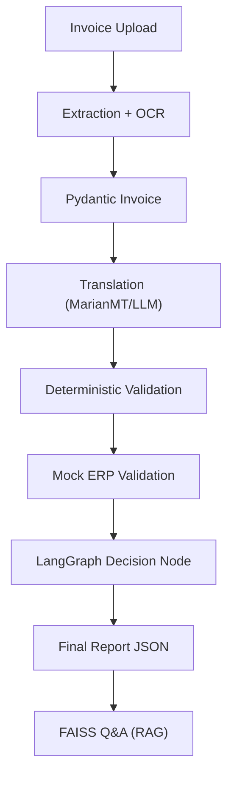
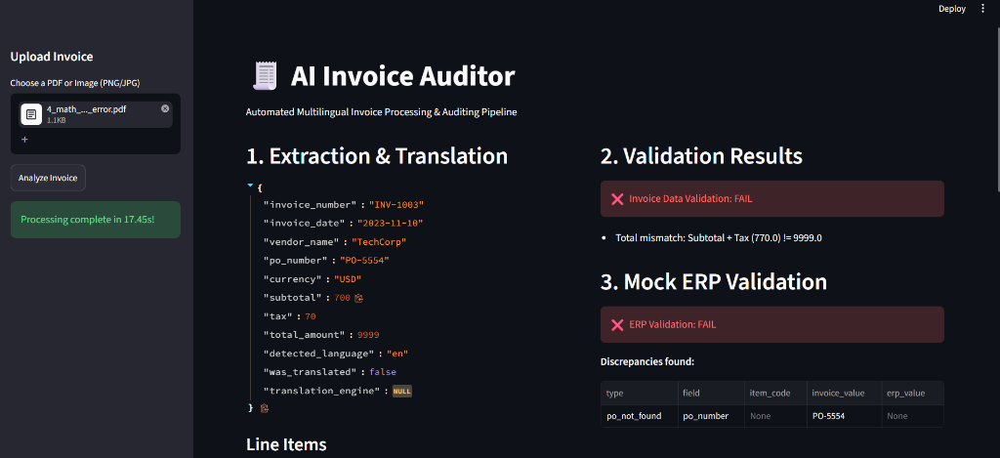
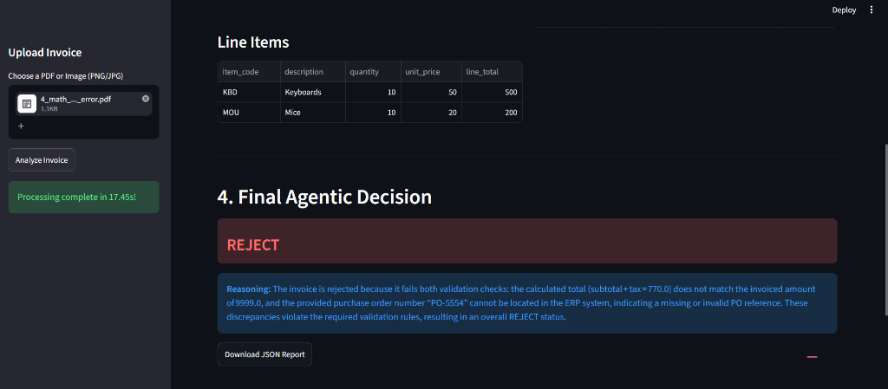
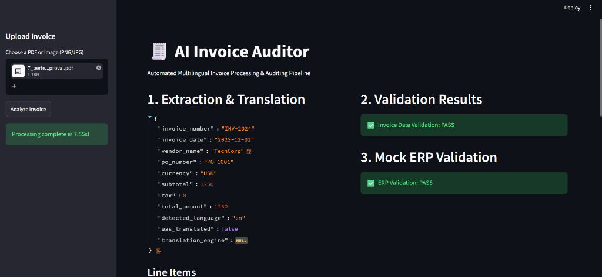
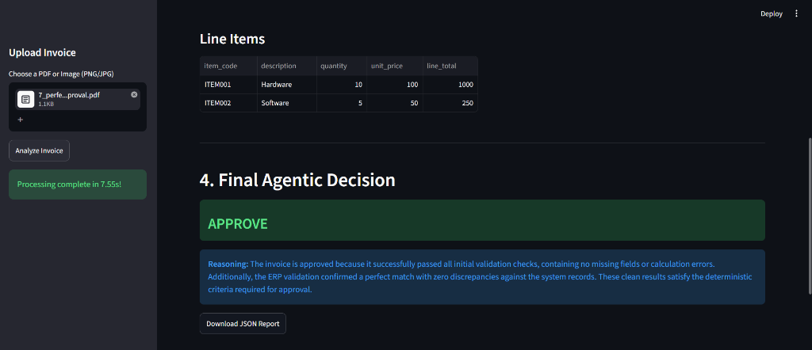
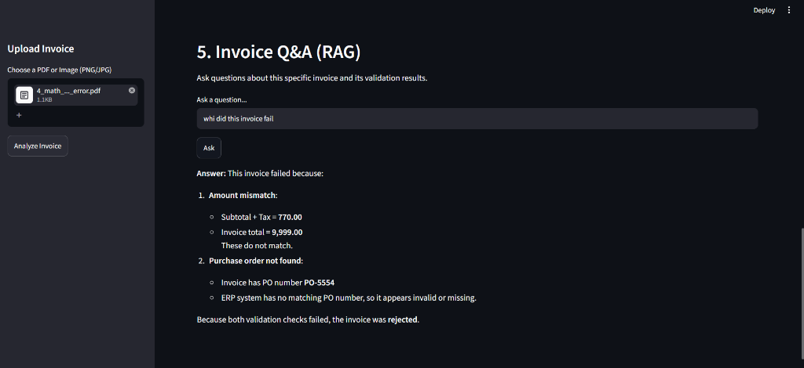

# AI Invoice Auditor

## Overview
The AI Invoice Auditor is an automated, multilingual invoice validation system. It is designed to act as a complete end-to-end solo portfolio project that ingests invoices, extracts their contents, translates them into English if needed, performs rigorous deterministic math and data checks, compares against a mock ERP system, and uses an agentic LLM workflow to summarize findings and answer questions.

## Problem
Processing invoices manually is a tedious, error-prone, and slow process. This is especially difficult when dealing with international vendors who submit invoices in various languages or formats (PDFs, Images). An AI-assisted auditor reduces this workload by flagging discrepancies instantly.

## Solution
This project automatically:
1. Extracts text from PDFs and Images.
2. Identifies the source language (including Indic languages like Hindi, Telugu, Kannada, Tamil).
3. Translates non-English fields into English using MarianMT (with LLM fallback).
4. Deterministically validates calculations (subtotals, tax, total).
5. Cross-checks values (Price, Qty, Vendor, PO) against a mock ERP backend.
6. Makes an `APPROVE`, `MANUAL_REVIEW`, or `REJECT` decision.
7. Enables users to ask natural language questions about the invoice via RAG.

## Architecture


## Features
* **Multi-format Support:** PDF, PNG, JPG.
* **Deterministic Parsing:** Safe extraction of line items, totals, and fields.
* **Multilingual:** Supports English, Hindi, Telugu, Tamil, and Kannada.
* **ERP Mock:** FastAPI backend simulating an enterprise resource system.
* **Agentic Workflow:** Built with LangGraph.
* **RAG Q&A:** Chat with your processed invoice using FAISS vector search.
* **Clean UI:** Streamlit interface.

## Screenshots
### Validation & Rejection



### Perfect Approval



### RAG Q&A Feature


## Tech Stack
* **Python**
* **Streamlit** (Frontend)
* **FastAPI** (Mock ERP)
* **LangGraph** (Agentic workflow)
* **LangChain & FAISS** (RAG/QA)
* **Pydantic** (Data modeling)
* **PyMuPDF & Pytesseract** (OCR and parsing)
* **Transformers (MarianMT)** (Local translation)
* **LiteLLM / OpenRouter** (LLM connectivity)

## Project Structure
```text
├── app.py                      # Streamlit UI
├── api/
│   └── mock_erp.py             # FastAPI backend
├── configs/
│   └── settings.py             # App configurations
├── data/                       # Mock ERP databases
├── models/
│   └── invoice_models.py       # Pydantic schemas
├── rag/
│   └── rag_service.py          # FAISS indexing & QA
├── services/                   # Core business logic
│   ├── extraction_service.py
│   ├── translation_service.py
│   ├── validation_service.py
│   └── erp_service.py
├── workflow/
│   └── invoice_workflow.py     # LangGraph orchestrator
├── tests/                      # Pytest suite
└── sample_invoices/            # Test data
```

## Installation
1. Clone the repository and navigate to the directory.
2. Create a virtual environment:
   ```bash
   python -m venv venv
   source venv/bin/activate  # On Windows: venv\Scripts\activate
   ```
3. Install dependencies:
   ```bash
   pip install -r requirements.txt
   ```
4. Install system dependencies for Tesseract if not already installed (e.g. `apt-get install tesseract-ocr`).

## Environment Variables
Copy the `.env.example` file to `.env`:
```bash
cp .env.example .env
```
Inside `.env`, you MUST set your OpenRouter API key:
```env
OPENROUTER_API_KEY=your_actual_key_here
OPENROUTER_MODEL=google/gemma-3-4b-it
ERP_API_BASE_URL=http://localhost:8000
```
> **Note:** The LLM features (Decision Explanation and RAG Q&A) will gracefully disable if the API key is not present, while deterministic validations will still function perfectly.

## Running the Project

You need to run two terminal windows.

**Terminal 1: Start Mock ERP**
```bash
python api/mock_erp.py
```

**Terminal 2: Start Streamlit UI**
```bash
streamlit run app.py
```

## Testing
Run the test suite using pytest:
```bash
pytest tests/ -v
```

## Workflow Details
When an invoice is uploaded, the LangGraph workflow triggers. It sequentially runs the extraction service (falling back to OCR for images). The parsed data is structured into a Pydantic object, translating vendor names and descriptions via MarianMT. Deterministic math validates the invoice logic. Then, the Mock ERP endpoint is queried. Finally, the agentic node processes all deterministic results to formulate a final conclusion (Approve/Reject/Review) which is returned to the user in a JSON report and indexed for Q&A.

## Limitations
* OCR relies on Tesseract, which may struggle with highly stylized invoices.
* Multilingual support is currently restricted to English and the four supported Indic languages for simplicity.
* The mock ERP has a very small, fictional dataset.

## Future Improvements
* Integrate more sophisticated Vision-Language Models (VLMs) as an extraction fallback.
* Expand the Mock ERP to support complex PO line item mapping.
* Support real-time Human-in-the-loop dashboarding.
